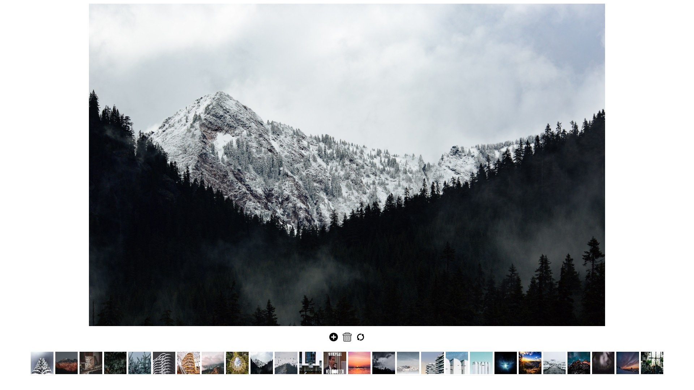
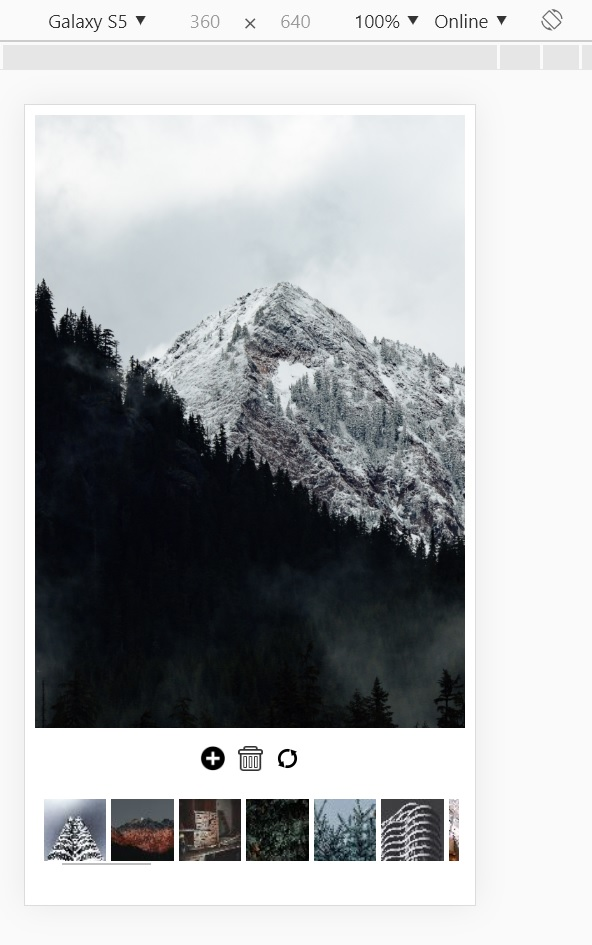
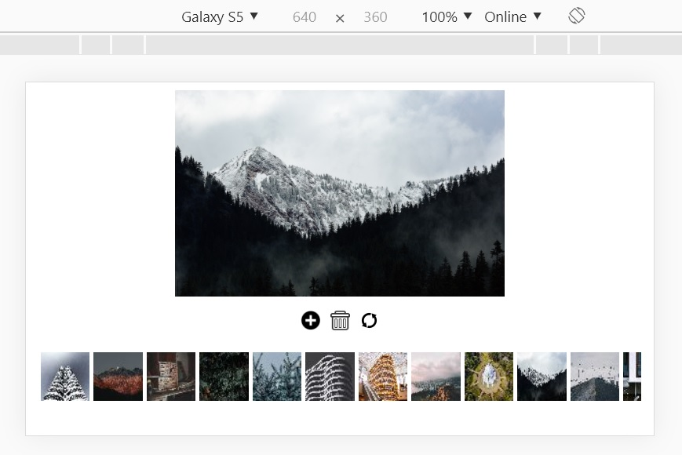

# Gallery Online

Реализация простейшей онлайн-галереи с адаптивным дизайном.
Технологии:
1. AngularJS (клиент)
2. PHP (сервисы)
3. Imagic (сжатие загруженных изображений)
4. Apache (сервер)

### Запуск

1. Для запуска сервера с xampp перезапишите файл httpd.conf на [следующий](WebSite/App/restricted) файл конфигурации.
2. Затем поправьте в данном файле пути к корню проекта в рубрике "# MY SETTINGS"
3. Также поправьте пути к корню в файле ["init.php"](WebSite/App/init.php)

### Пример работы

| | |
| --- | ---: |
|  |
|  |  |
